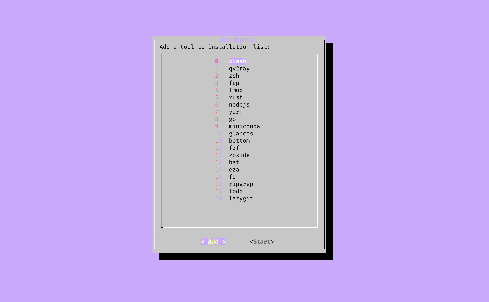
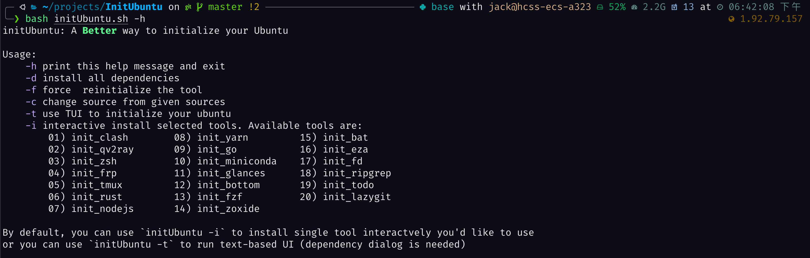

# InitUbuntu: A Simple Way to Initialize Your Ubuntu

**又是一个困在Ubuntu配置的深夜? 别担心, 本仓库将会帮助你 :)**

本仓库包含了用于快速初始化 `Ubuntu` 系统的脚本和配置文件。这些脚本和配置文件可以帮助你快速配置和安装一些常用的工具和软件。

## 使用方法

1. 克隆该仓库到本地：

   ```bash
   git clone https://github.com/your-username/InitUbuntu.git
   ```

2. 进入仓库目录：

   ```bash
   cd InitUbuntu
   ```

3. 运行脚本：

   运行下述命令以查看如何使用该脚本

   ```bash
   bash initUbuntu -h
   ```
   

4. 根据提示选择你想要配置的选项。

   - 选择 `USTC` 可以将系统的软件源更换为中科大源。
   - 选择 `Clash` 可以配置 `Clash` 代理工具。
   - 选择 `Qv2ray` 可以配置 `Qv2ray` 代理工具。
   - 选择 `ZSH` 可以配置 `ZSH` 终端。
   - 选择 `TMUX` 可以配置 `TMUX` 终端复用工具。
   - 选择 `FRP` 可以配置 `FRP` 内网穿透工具。
   - 选择 `NodeJS` 可以配置 `NodeJS` 运行环境。
   - 选择 `Rust` 可以配置 `Rust` 编程语言环境。
   - 选择 `VIM` 可以配置 `VIM` 编辑器。
   - 选择 `LunarVIM` 可以配置 `LunarVIM` 编辑器。
   - 选择 `QEMU` 可以配置 `QEMU` 虚拟机。
   - 选择 `RISCV-Tools` 可以配置 `RISCV-Tools` 工具链。
   - 选择 `Miniconda` 可以配置 `Miniconda` 环境。
   - 选择 `Bottom` 可以配置 `Bottom` 系统监控工具。
   - 选择 `Glances` 可以配置 `Glances` 系统监控工具。
   - 选择 `Zoxide` 可以配置 `Zoxide` 目录导航工具。
   - 选择 `Bat` 可以配置 `Bat` 文件查看工具。
   - 选择 `Go` 可以配置 `Go` 编程语言环境。
   - 选择 `eza` 可以配置 `eza` 文件导航工具。
   - 选择 `fd` 可以配置 `fd` 文件搜索工具。
   - 选择 `ripgrep` 可以配置 `ripgrep` 文本搜索工具。

5. 根据提示完成配置。

**PS: 该仓库使用到了很多Ubuntu特定的命令无法在你的操作系统上运行? 别担心, 查看`init.sh`其中有不少配置命令可以拿出来直接使用**

## 注意事项

- 运行脚本前，请确保已经安装了 `dialog` 工具。
- 运行脚本需要具有 `sudo` 权限。
- 部分配置可能需要重启终端才能生效。

## 贡献

如果你有任何改进或建议，欢迎提交 `Issue` 或 `Pull Request`。感谢您的贡献！
